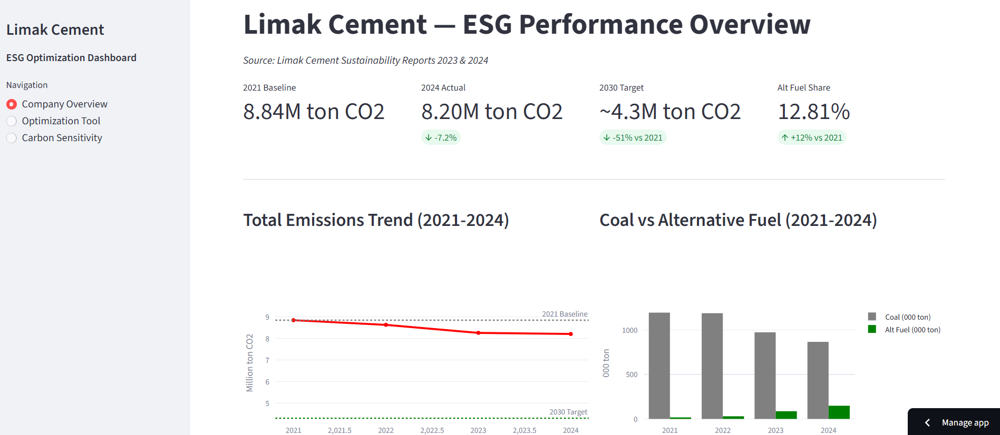

# Cement Industry Carbon Footprint & Cost Optimization
### A Data Science Portfolio Project | Limak Cement Real ESG Data (2021–2024)

## Interactive Dashboard

Live Demo: https://limak-cement-esg.streamlit.app

The Streamlit dashboard includes:
- **Company Overview**: Real ESG performance trends + gap analysis
- **Optimization Tool**: Interactive what-if analysis with real-time status checks
- **Carbon Sensitivity**: Strategic zone visualization + decision matrix

## Project Overview

This project builds an optimization model for the cement industry to minimize
CO2 emissions and production costs by optimizing clinker ratio, alternative fuel
usage, and carbon cost exposure.

All analysis is based on real sustainability report data from Limak Cement (2021-2024),
one of Turkey's largest cement producers.

## Key Findings

- Total GHG emissions declined 7.2% from 2021 to 2024 (8.84M to 8.20M ton CO2)
- Alternative fuel usage grew 9x: 17K ton (2021) to 149K ton (2024)
- Carbon price tipping point identified at $65/ton CO2
- At $119/ton CO2, carbon cost overtakes fuel cost entirely
- 2030 target (61% alt fuel) delivers est. ~$29/ton clinker cost saving vs current

## Project Structure

- 01_eda.ipynb: Exploratory Data Analysis
- 02-optimization.ipynb: Optimization Model and Scenario Analysis
- dashboard/app.py: Interactive Streamlit Dashboard

## Methodology

- Emission Model: Emissions = clinker_ratio x 0.85 + (1 - alt_fuel_share) x 0.30
- Optimization: scipy.optimize with realistic operational constraints
- Scenarios: Conservative (25%), Moderate (40%), 2030 Target (61%), Stretch (70%)
- Carbon Sensitivity: Tipping point analysis across $20-$200/ton CO2 range

## Data Sources

- Limak Cement Sustainability Report 2023
- Limak Cement Sustainability Report 2024

## Tech Stack

Python | Pandas | NumPy | Matplotlib | Seaborn | SciPy | Streamlit | Plotly

## Model Limitations

- Linear cost functions - real-world diminishing returns not fully captured
- Supply constraints for alternative fuels not modeled
- Capex costs for infrastructure transition excluded
- Results are directional, not prescriptive

## Author

Ali K Kiziltoprak
GitHub: https://github.com/Alikkiziltoprak

